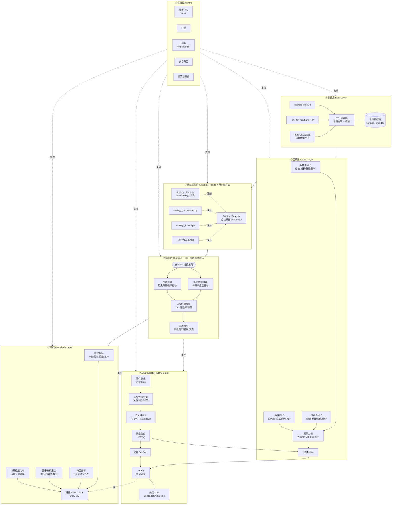
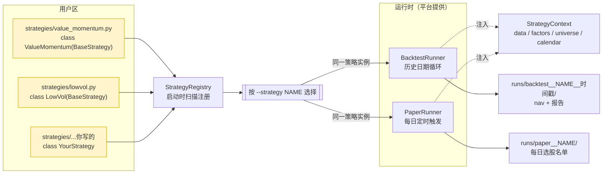
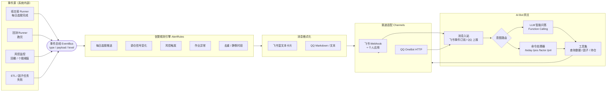

# A 股量化选股系统 · 规划与架构

> 版本：v0.2 ｜ 日期：2026-05-11 ｜ 范围：A 股全市场，**策略插件化**研究平台 — 用户自带策略，平台负责数据 / 回测 / 纸交易 / 报告

---

## 一、系统定位与目标

**一句话定位**：一套面向 A 股的"个人级"量化选股研究平台，**策略由用户编写并以插件形式接入**，平台负责数据、因子、回测、纸交易、报告等通用能力，让一份策略代码"既能跑回测，又能跑每日选股"。

**核心目标**

1. **数据可复现**：以 Tushare Pro 为主数据源，落地一份本地化的"干净数据湖"，离线可用。
2. **因子可复用**：基本面、技术面、事件 / 另类数据三类因子统一接口、统一落库，可被任意策略调用。
3. **策略可插拔**：用户在 `strategies/` 目录扔一个 `.py` 文件、继承 `BaseStrategy` 即可被自动发现；CLI / 配置按 **策略名** 选择运行哪一个。
4. **一份策略两种运行**：同一个策略类，既可被回测引擎驱动跑历史，也可被纸交易调度器驱动每日输出选股名单。
5. **回测可信赖**：T+1、涨跌停、停牌、复权、手续费、滑点、ST 过滤等 A 股特性必须建模。
6. **结果可解释**：每次回测 / 每日纸交易都产出标准化报告（收益、风险、归因、换手、个股贡献）。
7. **及时可触达**：每个交易日收盘后通过**飞书 / QQ** 推送选股名单 + 逻辑分析 + 风控告警；并提供一个**双向 AI Bot**，用户随时可以问"今天为什么选 X"、"我账户表现如何"、"什么是 Barra 风格因子"等问题。

**非目标（v1 不做）**

- 真实券商下单
- 期权 / 期货 / 可转债 / 港美股
- 高频（分钟级以下）策略
- 多用户协作 / 权限管理

---

## 二、A 股市场特殊性（设计前必须明确）

这一节决定了后面架构里很多"看似多余"的模块为什么必须存在。

- **T+1 与涨跌停**：当日买入次日才能卖；涨停板买不到、跌停板卖不掉，回测撮合必须建模。
- **停牌 / ST / 退市**：选股池要动态过滤，避免幸存者偏差。
- **复权**：行情数据有前复权 / 后复权 / 不复权三套，因子计算与绩效计算用的是不同的复权口径，必须分清。
- **财报披露节奏**：季报、半年报、年报有披露窗口，使用财务数据要做 **Point-in-Time (PIT)** 处理，避免未来函数。
- **新股 / 次新股**：上市 N 天内剔除，避免炒作扰动。
- **指数成分股**：沪深 300 / 中证 500 / 中证 1000 成分股每半年调整，回测股票池需动态。
- **交易日历**：A 股有春节、国庆等长假，必须使用交易日历而非自然日。
- **行业分类**：申万一级 / 中信一级两套主流分类，用于行业中性化。

---

## 三、整体架构图



### 三·五、策略 ↔ 运行时关系图（核心思想）

> 一份策略代码 = 一个 `BaseStrategy` 子类。回测和纸交易只是**两个不同的驱动器**调用同一个 `select()` 方法。



**三件事记住就够了**：

1. 用户**只写策略类**（黄色块），其它一切平台都给。
2. **同一份策略代码**，回测和纸交易都能跑——切换的是 Runner，不是策略。
3. CLI 用 `--strategy NAME` 选哪个策略，参数走 YAML，互不冲突。

---

## 四、各层模块详细设计

### 4.1 数据层（Data Layer）

**职责**：把外部数据可靠、可复现、可增量地落到本地。

**数据集清单（v1 必备）**

| 数据集 | 频率 | 用途 | 关键字段 |
|---|---|---|---|
| 交易日历 | 一次性 + 增量 | 所有时间逻辑的基准 | trade_date, is_open |
| 股票基础信息 | 日 | 上市/退市/行业/名称 | ts_code, list_date, delist_date, industry |
| 日线行情（前复权） | 日增量 | 因子 / 收益计算 | open, high, low, close, vol, amount |
| 日线行情（不复权） | 日增量 | 涨跌停判断 | close, pre_close, limit_up, limit_down |
| 复权因子 | 日增量 | 自定义复权 | adj_factor |
| 资金流 / 龙虎榜 | 日增量 | 事件因子 | net_inflow, top_list |
| 北向资金（沪深股通） | 日增量 | 资金面因子 | hold_ratio, net_buy |
| 财务三表 | 季增量 | 基本面因子（PIT） | income / balance / cashflow |
| 业绩预告 / 快报 | 事件 | 事件因子 | forecasttype, p_change |
| 分红送转 | 事件 | 复权 / 事件 | div_proc |
| 指数成分与权重 | 月 | 股票池 / 基准 | con_code, weight |
| 申万行业分类 | 月 | 行业中性 | sw_l1, sw_l2 |

**存储选型**

- **Parquet + 分区目录**（按 `freq=D / asset=stock / year=YYYY`）：列存压缩好、读取快、被 pandas / polars / DuckDB 原生支持。
- **DuckDB**：作为查询入口，支持类 SQL 跑因子，几乎零运维。
- **元数据表**（SQLite）：记录"哪些表更新到哪一天"，支持断点续跑。

**ETL 关键约束**

- 所有原始落地"一字不改"，转换在下游做。
- 每张表带 `update_time` 字段，便于排错。
- 增量逻辑：`max(trade_date) in DB → today` 拉差集；财务表用 `f_ann_date`（实际披露日）做 PIT 切片。
- 数据校验：行数 / 主键唯一 / 关键字段非空 / 价格非负 / 涨跌幅 < ±20% (科创板 / 创业板 ±20%, 主板 ±10%, ST ±5%)。

### 4.2 因子层（Factor Layer）

**因子分类（v1 内置约 30~50 个）**

- **基本面**：PE_TTM、PB、PS、ROE、ROA、净利同比、营收同比、毛利率、资产负债率、应收账款周转、自由现金流 / 市值。
- **技术面**：1M / 3M / 6M / 12M 动量、反转（短期收益反向）、振幅、换手率、特异波动率（IVOL）、量价相关性、20 日均线偏离度。
- **事件 / 另类**：北向持股变化、龙虎榜净买入、研报评级上调数、业绩预告类型、解禁压力、大股东增减持。

**因子工程统一流水线**

```
原始因子 → 缺失值处理 → 去极值（MAD / 分位数）→ 行业 + 市值中性化（回归取残差）→ 截面 zscore → 落库
```

**因子库表结构**（Parquet 按日分区）

```
factor_lib/
  factor_name=mom_20d/
    trade_date=2026-05-11/part.parquet  # ts_code, raw, neutralized, zscore
```

**关键设计决定**

- 所有因子都同时存 `raw / neutralized / zscore` 三列，下游策略按需取。
- 因子计算 = 纯函数（输入数据 + 日期 → 输出 DataFrame），便于单测、便于并行。

### 4.3 策略插件层（Strategy Plugins）★用户编写★

**核心思想**：策略层是平台的"用户代码区"——你写策略，平台不假设它是多因子还是技术面还是事件驱动。平台提供的是**接口契约 + 数据上下文 + 自动发现机制**。

#### 4.3.1 BaseStrategy 接口契约

所有策略继承 `BaseStrategy`，只需实现一个核心方法 `select(date, ctx) -> DataFrame`：

```python
# alphaforge/strategy/base.py
from abc import ABC, abstractmethod
from dataclasses import dataclass
import pandas as pd

@dataclass
class StrategyContext:
    """平台注入给策略的"上下文"——封装数据访问、因子库、股票池"""
    data: "DataAPI"          # 行情 / 财务 / 复权 / 涨跌停查询
    factors: "FactorAPI"     # 因子库读取（zscore / 中性化后值）
    universe: "UniverseAPI"  # 当日可交易股票池（已剔除 ST / 停牌 / 次新）
    calendar: "CalendarAPI"  # 交易日历
    params: dict             # YAML 注入的策略参数

class BaseStrategy(ABC):
    """A 股选股策略基类。一个子类 = 一个策略。"""

    name: str = "unnamed"           # 策略唯一标识（CLI / 配置中按 name 选）
    description: str = ""           # 一行说明
    rebalance: str = "M"            # 调仓频率：D / W / M / Q
    benchmark: str = "000300.SH"    # 基准

    def setup(self, ctx: StrategyContext) -> None:
        """运行前钩子：用于做一次性预计算（缓存、加载模型等）。可选。"""
        pass

    @abstractmethod
    def select(self, date: pd.Timestamp, ctx: StrategyContext) -> pd.DataFrame:
        """
        在调仓日 `date` 选股并给出权重。
        返回 DataFrame，列必须包含：
          - ts_code: str       股票代码
          - weight: float      目标权重（和为 1.0 或更小）
        其它列（如 score / reason）会被报告层透传展示。

        ⚠️ 注意：date 当天的"未来数据"不可用，平台会在 ctx.data 上做 PIT 截断。
        """
        ...

    def teardown(self, ctx: StrategyContext) -> None:
        """运行后钩子：用于持久化模型、清理资源。可选。"""
        pass
```

设计要点：

- **策略只关心"选股 + 权重"**，不需要关心 T+1 / 涨跌停 / 撮合 / 成本——这些由运行时统一处理。
- **PIT 安全**：`ctx.data` / `ctx.factors` 在传给策略前已经做了"截止到 `date` 的切片"，从机制上防未来函数。
- **同一接口，两种驱动**：回测引擎按历史日期循环调用 `select`；纸交易调度器在每个交易日收盘后调用一次 `select`。策略代码完全不感知差别。

#### 4.3.2 自动发现：StrategyRegistry

平台启动时扫描 `strategies/` 目录，把所有 `BaseStrategy` 子类注册到 `StrategyRegistry`：

```python
# alphaforge/strategy/registry.py
class StrategyRegistry:
    _registry: dict[str, type[BaseStrategy]] = {}

    @classmethod
    def discover(cls, root: Path = Path("strategies")) -> None:
        """递归 import strategies/*.py，找出所有 BaseStrategy 子类，按 name 注册。"""
        ...

    @classmethod
    def get(cls, name: str) -> type[BaseStrategy]:
        if name not in cls._registry:
            raise StrategyNotFound(name, available=list(cls._registry))
        return cls._registry[name]

    @classmethod
    def list(cls) -> list[dict]:
        """CLI: alphaforge strategy list 用，返回 name/description/rebalance"""
        ...
```

#### 4.3.3 用户写策略的体验

> 这是用户唯一需要碰的地方。

**示例：一个最简单的"低估值 + 动量"策略**

```python
# strategies/value_momentum.py
from alphaforge.strategy.base import BaseStrategy, StrategyContext
import pandas as pd

class ValueMomentumStrategy(BaseStrategy):
    name = "value_momentum"
    description = "低 PE + 6 月动量 Top50，月度调仓"
    rebalance = "M"

    def select(self, date, ctx: StrategyContext) -> pd.DataFrame:
        pool = ctx.universe.tradable(date)              # 当日可交易池

        pe   = ctx.factors.get("pe_ttm",  date, pool, mode="zscore_neutral")
        mom  = ctx.factors.get("mom_120", date, pool, mode="zscore_neutral")

        score = (-pe).rank() + mom.rank()               # 低 PE + 高动量
        top   = score.nlargest(self.params.get("top_n", 50))

        return pd.DataFrame({
            "ts_code": top.index,
            "weight":  1.0 / len(top),                  # 等权
            "score":   top.values,
        })
```

把这个文件丢进 `strategies/` 就行——重启 CLI 后它就能被 `--strategy value_momentum` 选中。

**用 YAML 控制参数（可选）**：

```yaml
# configs/run/value_momentum.yaml
strategy: value_momentum
params:
  top_n: 30
period:
  start: 2018-01-01
  end:   2025-12-31
benchmark: 000905.SH
costs:
  commission: 0.00025
  stamp_tax:  0.001
  slippage:   0.001
```

#### 4.3.4 策略可访问的"平台 API"

`StrategyContext` 暴露的几个 API 是稳定契约——策略代码只依赖它们，不直接读 Parquet：

| API | 关键方法 | 说明 |
|---|---|---|
| `ctx.data` | `bars(codes, start, end, adj="qfq")` / `prev_close` / `is_limit_up` | 行情查询，PIT 已截断 |
| `ctx.factors` | `get(name, date, codes, mode="zscore")` / `list_available()` | 因子库读取 |
| `ctx.universe` | `tradable(date)` / `index_members(idx, date)` | 可交易池、指数成分 |
| `ctx.calendar` | `prev(date, n)` / `next(date, n)` / `is_trade_day(date)` | 交易日历 |

#### 4.3.5 与"组合构建 / 优化器"的关系

策略的 `select()` 输出的 `weight` 默认就是最终权重。如果用户希望平台帮忙做约束优化（行业中性、个股上限、换手控制），可以选择启用平台内置 **PortfolioBuilder**：

```yaml
portfolio:
  optimizer: cvxpy
  constraints:
    industry_neutral: true
    max_weight: 0.05
    turnover_limit: 0.30
```

启用后，策略输出的 `weight` 会被当作"目标暴露"喂给优化器，再产出最终下单权重。**默认关闭**——用户没启用时，策略说啥就是啥。

### 4.4 运行时 — 回测引擎（Backtest Runner）

**关键定位**：回测引擎是策略的**驱动器**之一。它负责按历史日期循环调用 `strategy.select(date, ctx)`，把返回的目标权重交给撮合 + 约束 + 成本模型，得到净值曲线和成交记录。

**调用流程**

```
load strategy by name
    └─ for date in trade_dates(start, end):
         if is_rebalance_day(date, strategy.rebalance):
             targets = strategy.select(date, ctx)        # 用户代码
             orders  = portfolio_diff(current_pos, targets)
             execute(orders, constraints=A股约束, costs=成本模型)
         mark_to_market(date)
    └─ write trades / positions / nav / metrics
    └─ render report
```

**引擎选型对比**

| 选项 | 优点 | 缺点 | 建议 |
|---|---|---|---|
| 自研事件驱动引擎 | 灵活、贴合 A 股 | 工作量大 | v2+ 再做 |
| **vectorbt** | 速度极快、向量化 | 撮合细节弱 | **v1 推荐**：作为"权重 → 净值"快速回测器 |
| backtrader | 老牌、生态全 | 速度慢、A 股约束要自己加 | 备选 |
| qlib（微软） | A 股原生支持、ML 友好 | 学习曲线陡 | v2 接入做 ML 策略 |

> v1 的做法：策略只输出**目标权重**，因此 vectorbt 这类向量化回测器完全够用；但 A 股约束（涨跌停过滤、停牌剔除）必须在调用 vectorbt 前自己处理。

**A 股约束必须建模**

- T+1：当日买入数量进入 `frozen` 池，次日才能卖。
- 涨跌停：当日 `close == limit_up` 不能买入，`close == limit_down` 不能卖出 → 顺延到下一日撮合。
- 停牌：从可交易池剔除。
- 复权与撮合：撮合用不复权价 + 复权因子还原；绩效用前复权计算。
- 成本：双边佣金（默认万 2.5，最低 5 元）+ 卖出印花税（0.1%）+ 过户费（沪市万 0.1）+ 滑点（默认千 1）。

**输出标准化（按策略 + 时间戳分目录）**

```
runs/
  backtest__value_momentum__2026-05-11_193012/
    trades.parquet      # 每笔成交
    positions.parquet   # 每日持仓
    nav.parquet         # 每日净值与基准净值
    metrics.json        # 标准指标
    config.snapshot.yaml # 本次跑的完整参数快照（可复现）
    report.html         # 自动渲染的报告
```

### 4.5 分析层（Analysis Layer）

**因子分析（单因子）**

- IC / RankIC 时序与均值、t 值。
- 分组（一般 5 / 10 组）多空收益曲线。
- 因子换手率与衰减分析。

**组合绩效**

- 年化收益 / 波动 / 夏普 / Calmar / 最大回撤 / 回撤恢复期。
- 胜率 / 盈亏比 / 月度收益热力图。
- 相对基准的超额收益、信息比率、跟踪误差。

**归因**

- Brinson 行业归因（配置 / 选股 / 交互）。
- 风格归因（基于 Barra 风格因子回归）。

**输出**

- HTML 报告（推荐 quantstats + 自定义模板），可选导出 PDF。
- 关键图表：净值曲线 / 回撤曲线 / 月度热力图 / 因子 IC 分布 / 持仓行业雷达。

### 4.6 运行时 — 纸交易调度器（Paper Trading Runner）

**定位**：把"实盘"先做成"每日选股名单 + 模拟账户"——同一个 `BaseStrategy` 实例，由不同的驱动器调用。

**与回测的差别**

| 维度 | 回测 Runner | 纸交易 Runner |
|---|---|---|
| 触发方式 | CLI 一次性跑历史区间 | APScheduler 每个交易日 15:30 触发一次 |
| date 取值 | 历史日期循环 | 当天 |
| 撮合价 | 历史 OHLC | 暂用 T+1 开盘价 / 当日收盘价（可配） |
| 输出 | 完整回测报告 | 每日 `daily_signal.md` + 滚动模拟账户 |

**每日产物**（写到 `runs/paper__<strategy_name>/`）

```
runs/paper__value_momentum/
  daily/
    2026-05-12.json        # 当日 select() 结果（ts_code/weight/score）
    2026-05-12.md          # 渲染后的"今日选股名单"
  account.parquet          # 滚动模拟账户（每日净值、持仓）
  trade_log.parquet        # 模拟成交（按次日开盘价撮合）
```

**示例 daily_signal.md**

```markdown
# value_momentum · 2026-05-12 选股建议

调仓信号：是（月度调仓日）
基准：000300.SH

## 目标持仓（30 只，等权 3.33%）
| ts_code  | name | weight | score | 当前持仓? |
|----------|------|--------|-------|-----------|
| 600519.SH | 贵州茅台 | 3.33% | 1.82 | ✅ |
| 000858.SZ | 五粮液  | 3.33% | 1.71 | ➕ 新进 |
...

## 调仓单（次日开盘）
- 卖出：300750.SZ 宁德时代（评分掉出 Top30）
- 买入：000858.SZ 五粮液
```

**触发方式**

```bash
# 一次性跑当日（手动）
alphaforge paper run --strategy value_momentum --date 2026-05-12

# 守护进程：每个交易日 15:30 自动跑
alphaforge paper schedule --strategy value_momentum
```

**为什么这样设计就能无缝升级到真实下单（v2+）**

`PaperBroker` 与未来的 `RealBroker`（QMT / 同花顺 iFinD / Easytrader）实现同一接口 `Broker.execute(orders)`。从纸交易升级到实盘，**只换 Broker 实现，策略代码与运行时完全不动**。

### 4.7 通知 & AI Bot 层（Notify & Bot）

#### 4.7.1 定位与目标

通知层把"系统内部发生的事"翻译成**人能立刻读懂的卡片消息**，推到飞书 / QQ；AI Bot 反向接受用户提问，访问平台数据回答。

> 频率定位：**日维度低频**。不订阅分钟行情，不做盘中实时弹窗——系统只在"该看一眼"的时刻打扰你。

设计上分两条数据流：

- **下行**（系统 → 用户）：事件总线 → 告警规则 → 格式化 → 渠道路由 → 飞书 / QQ。
- **上行**（用户 → 系统）：飞书 / QQ Webhook → Bot 网关 → 意图路由（命令 / LLM）→ 调用平台 API → 返回回答。

#### 4.7.2 整体架构图



#### 4.7.3 事件总线（EventBus）

平台内部所有想触发通知的地方，只做一件事：**往 EventBus 发一个事件对象**。这样通知逻辑与业务逻辑解耦——以后加新渠道（Telegram / 邮件）零侵入。

```python
# alphaforge/notify/events.py
from dataclasses import dataclass, field
from datetime import datetime
from typing import Literal

@dataclass
class Event:
    type: Literal[
        "paper.daily_signal",     # 纸交易：每日选股
        "paper.rebalance",        # 调仓信号变化
        "risk.drawdown",          # 账户回撤超阈
        "risk.position_drop",     # 持仓个股跌幅超阈
        "job.failed",             # ETL / 因子任务失败
        "backtest.finished",      # 回测完成
    ]
    level: Literal["info", "warn", "critical"] = "info"
    title: str = ""
    payload: dict = field(default_factory=dict)
    ts: datetime = field(default_factory=datetime.now)
    strategy: str | None = None
```

发事件示例（纸交易 Runner 内部）：

```python
event_bus.publish(Event(
    type="paper.daily_signal",
    level="info",
    title=f"{strategy.name} · {date} 选股完成",
    payload={"date": date, "signals": targets, "rebalance": is_rebalance_day},
    strategy=strategy.name,
))
```

#### 4.7.4 告警规则引擎（AlertRules）

并不是所有事件都要发——规则引擎决定"发不发、发给谁、发哪条卡片"。规则用 YAML 描述：

```yaml
# configs/notify.yaml
channels:
  feishu:
    webhook: ${FEISHU_WEBHOOK}        # 群机器人 Webhook
    secret:  ${FEISHU_SECRET}
  qq:
    base_url: http://127.0.0.1:5700   # 本地 OneBot 服务
    target_group: 123456789

silent_hours:                          # 静默时段（除 critical 外不打扰）
  - "22:00-08:00"

rules:
  - on: paper.daily_signal
    where: "rebalance == true"         # 仅调仓日才推
    channels: [feishu]
    template: daily_rebalance.j2

  - on: paper.daily_signal             # 非调仓日只推持仓与盈亏
    where: "rebalance == false"
    channels: [feishu]
    template: daily_holding.j2

  - on: risk.drawdown
    where: "value > 0.10"              # 账户回撤超 10%
    level: warn
    channels: [feishu, qq]
    template: risk_drawdown.j2

  - on: risk.position_drop
    where: "pct < -0.07"               # 个股单日跌超 7%
    level: warn
    channels: [feishu]
    template: risk_position.j2
    dedupe: "ts_code+date"             # 同股同日只推一次

  - on: job.failed
    level: critical
    channels: [feishu, qq]
    template: job_failed.j2
```

引擎责任：**条件过滤 / 去重 / 静默时段 / 模板渲染 / 路由**。

#### 4.7.5 消息样例（飞书富文本卡片）

**例 1：调仓日的"每日选股 + 逻辑分析"**

```
📈 value_momentum · 2026-05-12 调仓信号
基准：000300.SH    本月涨跌：+3.2%（基准 +1.8%）

【目标持仓 30 只】
| 代码 | 名称 | 权重 | 评分 | 状态 |
|------|------|------|------|------|
| 600519.SH | 贵州茅台 | 3.33% | 1.82 | 保留 |
| 000858.SZ | 五粮液  | 3.33% | 1.71 | ➕ 新进 |
| 300750.SZ | 宁德时代 | —    | —    | ➖ 卖出 |

【调仓单（次日开盘执行）】
卖出：300750.SZ（评分掉出 Top30）
买入：000858.SZ（PE_TTM 分位 12% × Mom_120 分位 88%）

【逻辑分析】
本期前 30 只股票评分由两部分驱动：
• 估值（-PE_TTM 分位均值）：18%   → 偏低估
• 动量（Mom_120 分位均值）：72%   → 偏强势
风格暴露：行业偏向消费 / 医药；中市值倾向

[查看完整报告] [问 AI Bot]
```

**例 2：风控告警**

```
⚠️ value_momentum · 风控告警
触发规则：账户最大回撤 = 10.4%（阈值 10%）
持仓 30 只 / 当前净值 0.896
建议：检查持仓集中度与行业暴露
[查看持仓] [查看回撤明细]
```

#### 4.7.6 渠道适配（Channels）

每个渠道实现同一个抽象接口，新增渠道零侵入：

```python
# alphaforge/notify/channels/base.py
class Channel(ABC):
    @abstractmethod
    def send(self, msg: dict) -> None: ...

class FeishuChannel(Channel):
    """飞书自定义群机器人。
    - 富文本卡片用 interactive 消息类型
    - 加签校验（secret + timestamp）
    """
    def send(self, msg): ...

class QQChannel(Channel):
    """OneBot v11 协议（go-cqhttp / NapCat）。
    - 通过本地 HTTP API send_group_msg 发送
    - 富文本退化为 Markdown / 转图片
    """
    def send(self, msg): ...
```

> ⚠️ 飞书机器人有"频率限制 + 加签校验 + URL Mask"等坑，建议封装一个 `FeishuClient` 统一处理。

#### 4.7.7 AI Bot · 双向问答

Bot 不是一个独立服务——它是通知层的**反向通道**。复用同一个飞书应用 / QQ OneBot 的事件入口。

**架构选择**：意图路由 = 命令前缀优先 + LLM Function Calling 兜底。

| 输入 | 路由结果 | 调用 |
|---|---|---|
| `/today` 或 `今天选了哪些` | 命令处理器 | 读 `runs/paper__*/daily/最新.json` |
| `/pos` 或 `当前持仓` | 命令处理器 | 读账户 parquet |
| `/factor 600519.SH pe_ttm` | 命令处理器 | 查因子库 |
| `/pnl 7d` | 命令处理器 | 算近 7 日收益 |
| `为什么今天选了五粮液？` | LLM + Tools | 取该股因子贡献 + 生成自然语言解释 |
| `什么是 Barra 风格因子？` | LLM 自由问答 | 走 LLM，不调工具 |

**LLM 接入**：默认 DeepSeek（性价比高），通过统一的 `LLMClient` 抽象，可在 YAML 切到 Anthropic / OpenAI / 通义。

```yaml
# configs/notify.yaml（续）
bot:
  enabled: true
  llm:
    provider: deepseek            # deepseek | anthropic | openai | qwen
    model: deepseek-chat
    api_key: ${DEEPSEEK_API_KEY}
  tools:
    - get_daily_signal            # 取最新选股名单
    - get_position                # 取当前持仓
    - get_factor_value            # 取个股因子值
    - get_strategy_explanation    # 取选股逻辑（评分构成）
    - get_account_pnl             # 取账户收益
  max_history: 10                 # 单会话保留对话轮数
  rate_limit: 30/hour             # 防滥用
```

**LLM Function Calling 工具集示例**：

```python
# alphaforge/notify/bot/tools.py
@tool
def get_strategy_explanation(strategy: str, ts_code: str, date: str | None = None) -> dict:
    """解释某个策略在某日选中某只股票的原因 —— 返回因子贡献明细。"""
    record = read_run(f"runs/paper__{strategy}/daily/{date}.json")
    factors = record["factor_contributions"][ts_code]
    return {
        "ts_code": ts_code,
        "score": record["scores"][ts_code],
        "factors": factors,         # {"pe_ttm": -1.2, "mom_120": 1.8, ...}
        "rank": record["ranks"][ts_code],
    }
```

**典型对话**：

```
用户：为什么今天选了五粮液？

Bot：今天 value_momentum 把 000858.SZ 排进了前 30 名（综合评分 1.71，排名 12）。
    主要原因：
    1. 估值低 — PE_TTM 截面 zscore = -1.6（行业内偏低）
    2. 动量强 — 120 日动量 zscore = +1.5（前 12% 分位）
    3. 行业暴露 — 食品饮料行业当前在策略中占比 14%，未触上限
    
    模型给出的因子贡献：估值 +0.85，动量 +0.92，其他 -0.06。
    
    需要看完整逻辑或与昨日对比吗？回复 /diff 000858.SZ 查看。
```

#### 4.7.8 安全与可靠性

- **签名校验**：飞书 webhook 校验 timestamp + sign；接收事件时校验 token，防伪造。
- **API key 隔离**：所有 secret 走 `.env` / 环境变量，绝不入库 / 入 git。
- **降级策略**：飞书发送失败 → 自动降级到 QQ；都失败则写入 `notify_dlq.parquet`（死信队列），下一个交易日重试。
- **消息节流**：风控告警同一类型 30 分钟内不重复推送（dedupe key 可配）。
- **Bot 权限**：Bot 仅能查询不能下单——v1 不暴露任何写操作工具。

### 4.8 基础设施（Infra）

- **配置中心**：所有"魔法数字"（手续费率、调仓频率、股票池等）放在 `configs/*.yaml`。
- **日志**：loguru，按模块分文件，错误日志单独留存。
- **调度**：APScheduler 跑日级 ETL + 纸交易日度任务；本地够用，不需要 Airflow。
- **测试**：pytest 覆盖因子计算与回测约束；A 股特殊场景（涨跌停日、停牌日、除权日）必须有专门用例。
- **CLI**：统一入口 `alphaforge`，子命令包括 `data update / factor build / strategy list / backtest run / paper run / paper schedule / notify test / bot serve / report build`。
- **密钥管理**：`.env` + pydantic-settings，禁止入 git。

---

## 五、目录结构（建议）

```
alphaforge/
├── configs/                      # YAML 配置（用户区）
│   ├── data.yaml                 # 数据源 / token / 路径
│   ├── factors.yaml              # 因子开关与参数
│   └── run/                      # 每个 run 的参数文件
│       ├── value_momentum.yaml
│       ├── lowvol.yaml
│       └── ...
├── strategies/                   # ★用户策略目录 — 你写在这里★
│   ├── __init__.py
│   ├── value_momentum.py
│   ├── lowvol.py
│   ├── event_north_buy.py
│   └── ml_lightgbm.py
├── data_lake/                    # 本地数据湖（gitignore）
│   ├── raw/                      # Tushare 原始落地
│   ├── derived/                  # 复权后 / 衍生表
│   └── factors/                  # 因子库
├── runs/                         # 每次回测 / 纸交易的输出（gitignore）
│   ├── backtest__value_momentum__2026-05-11_193012/
│   └── paper__value_momentum/
├── alphaforge/                   # 平台代码包（不需要用户改）
│   ├── data/
│   │   ├── tushare_client.py
│   │   ├── etl.py
│   │   ├── calendar.py
│   │   └── universe.py
│   ├── factors/
│   │   ├── base.py
│   │   ├── fundamental/
│   │   ├── technical/
│   │   ├── event/
│   │   └── pipeline.py
│   ├── strategy/                 # ★策略框架，不放用户策略★
│   │   ├── base.py               # BaseStrategy / StrategyContext
│   │   ├── registry.py           # StrategyRegistry 自动发现
│   │   ├── api.py                # ctx.data / ctx.factors / ctx.universe
│   │   └── portfolio.py          # 可选的 PortfolioBuilder（约束优化）
│   ├── runtime/                  # ★两种运行时★
│   │   ├── backtest.py           # 历史日期循环驱动
│   │   ├── paper.py              # 每日纸交易驱动
│   │   ├── broker.py             # Broker 抽象（Paper / 未来 Real）
│   │   ├── constraints.py        # T+1 / 涨跌停 / 停牌
│   │   └── costs.py
│   ├── analysis/
│   │   ├── factor_report.py
│   │   ├── perf_report.py
│   │   └── attribution.py
│   ├── notify/                   # ★通知 & Bot 层★
│   │   ├── events.py             # Event / EventBus
│   │   ├── rules.py              # AlertRules YAML 引擎
│   │   ├── templates/            # Jinja2 卡片模板
│   │   │   ├── daily_rebalance.j2
│   │   │   ├── daily_holding.j2
│   │   │   ├── risk_drawdown.j2
│   │   │   └── job_failed.j2
│   │   ├── channels/
│   │   │   ├── base.py
│   │   │   ├── feishu.py
│   │   │   └── qq.py
│   │   └── bot/
│   │       ├── server.py         # FastAPI/aiohttp 接收 webhook
│   │       ├── router.py         # 命令 vs LLM 路由
│   │       ├── commands.py       # /today /pos /factor /pnl ...
│   │       ├── llm.py            # LLMClient 抽象
│   │       └── tools.py          # Function Calling 工具集
│   ├── infra/
│   │   ├── config.py
│   │   ├── logger.py
│   │   └── scheduler.py
│   └── cli.py                    # 命令行入口
├── notebooks/
├── tests/
├── pyproject.toml
└── README.md
```

**关键边界**：
- `alphaforge/` 是平台代码——用户不该改。
- `strategies/` 是用户区——丢 `.py` 文件，自动被发现。
- `configs/run/*.yaml` 是参数区——切换策略只需 `--config configs/run/xxx.yaml`。

---

## 五·五、CLI 命令一览

CLI 是平台与用户的主要交互入口。所有命令都通过 `--strategy <name>` 选择策略。

```bash
# 数据
alphaforge data update                      # 增量更新数据湖
alphaforge data check                       # 数据完整性检查

# 因子
alphaforge factor build --name mom_120      # 计算单个因子
alphaforge factor build --all               # 全量计算
alphaforge factor report --name mom_120     # 因子分析报告（IC / 分组）

# 策略管理
alphaforge strategy list                    # 列出所有已发现的策略
alphaforge strategy info value_momentum     # 查看某策略的元信息

# 回测
alphaforge backtest run \
    --strategy value_momentum \
    --config configs/run/value_momentum.yaml
alphaforge backtest compare \
    --runs run_id_1 run_id_2                # 多策略对比

# 纸交易
alphaforge paper run --strategy value_momentum --date 2026-05-12
alphaforge paper schedule --strategy value_momentum   # 守护进程：每日 15:30 跑

# 报告
alphaforge report build --run run_id

# 通知 & Bot
alphaforge notify test --channel feishu          # 测试通知通道
alphaforge notify send --event paper.daily_signal --payload-file ...
alphaforge bot serve --port 8765                 # 启动 Bot 服务（接收飞书/QQ webhook）
```

---

## 六、技术选型清单

| 模块 | 选型 | 理由 |
|---|---|---|
| 语言 | Python 3.11+ | 生态最全，足够 |
| 数据源 | Tushare Pro（主） + AkShare（补充） | A 股主流，社区成熟 |
| 数据存储 | Parquet + DuckDB | 列存 + 零运维 SQL |
| 元数据 | SQLite | 轻量足够 |
| 数据处理 | pandas + polars（大表） + numpy | 标配 |
| 回测 | vectorbt（v1） + qlib（v2） | 先快，后扩 |
| 优化器 | cvxpy | 组合优化 |
| ML | scikit-learn / lightgbm | 截面回归 |
| 可视化 | matplotlib + plotly + quantstats | 报告与交互 |
| 报告 | jinja2 + WeasyPrint | HTML / PDF |
| 调度 | APScheduler | 单机够用 |
| 日志 | loguru | 简单好用 |
| 配置 | pydantic-settings + YAML | 类型校验 |
| 测试 | pytest + hypothesis | 覆盖 A 股边界 |
| 包管理 | uv 或 poetry | 都行 |

---

## 七、阶段性里程碑（建议 10 周）

| 阶段 | 周数 | 交付物 |
|---|---|---|
| **M0** 项目骨架 | W1 | 目录、配置、日志、Tushare 连通性 demo |
| **M1** 数据层 | W2~W3 | 全市场日线 + 财务 + 指数成分落库，增量调度跑通；交易日历 / 股票池服务 |
| **M2** 因子层 | W4~W5 | 30 个因子计算 + 中性化；单因子分析报告（IC / 分组） |
| **M3** 策略框架 + 回测 Runner | W6 | `BaseStrategy` / `StrategyRegistry` / `StrategyContext`；vectorbt 回测；A 股约束（T+1 / 涨跌停 / 停牌）覆盖；交付 1 个示例策略 |
| **M4** 分析与报告 + 纸交易 Runner | W7 | 绩效报告 HTML 模板 + 行业归因；`PaperRunner` 每日 15:30 跑、输出 `daily_signal.md` |
| **M5** 通知层（单向推送） | W8 | EventBus + AlertRules + 飞书 / QQ Channel；每日选股卡片、风控告警；模板渲染 |
| **M6** AI Bot（双向问答） | W9 | Bot 网关 + 命令处理器 + LLM Function Calling；接入 DeepSeek，覆盖 5 个核心工具 |
| **M7** 集成 + 文档 | W10 | CLI 串联全流程；README + 复现脚本；3 个示例策略 |

---

## 八、风险与陷阱（提前规避）

1. **未来函数**：财务数据必须用披露日（`f_ann_date`）切片；指数成分必须用调整日切片。
2. **幸存者偏差**：股票池要包含历史已退市股票。
3. **复权陷阱**：因子计算用前复权 close，涨跌停判断用不复权 close + limit。
4. **样本内过拟合**：因子 / 策略必须有样本外测试集（建议 2022 之后留出）。
5. **Tushare 积分限制**：高频接口要分批 + 限速，注意每日调用上限。
6. **回测可执行性**：调仓日如遇大面积涨停 / 停牌，要模拟"买不进 / 卖不出"的真实约束。
7. **手续费与滑点**：默认值要保守（万 2.5 + 千 1 滑点），结果别太"漂亮"。
8. **通知噪声**：日维度低频策略，每天最多推 1~2 条主动消息——把"调仓 / 风控 / 异常"分级，info 走静默时段，critical 才打扰。
9. **Bot 不可写**：v1 严格限制 Bot 工具集为只读，绝不暴露下单 / 修改持仓接口。
10. **LLM 上下文溢出**：Bot 单会话保留有限轮数（默认 10），超长上下文时主动截断；避免长对话把 token 烧光。
11. **凭证管理**：飞书 secret / Tushare token / LLM API key 一律走 `.env`，不入 git；建议本地用 `direnv` 管理。

---

## 九、下一步建议

1. **先确认本规划**（哪些模块要砍 / 加，里程碑节奏是否合适）。
2. **拿到 Tushare Pro Token**（建议至少 5000 积分，能拿到主流财务接口）。
3. 我可以帮你：
   - 生成项目骨架（M0）
   - 写 ETL 脚本，把核心 5 张表先落库
   - 实现第一批因子并跑出 IC 报告

---

*本文档为规划稿，落地过程中按需迭代。*
